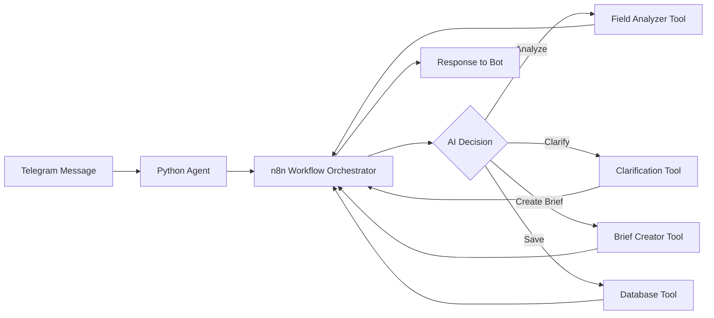
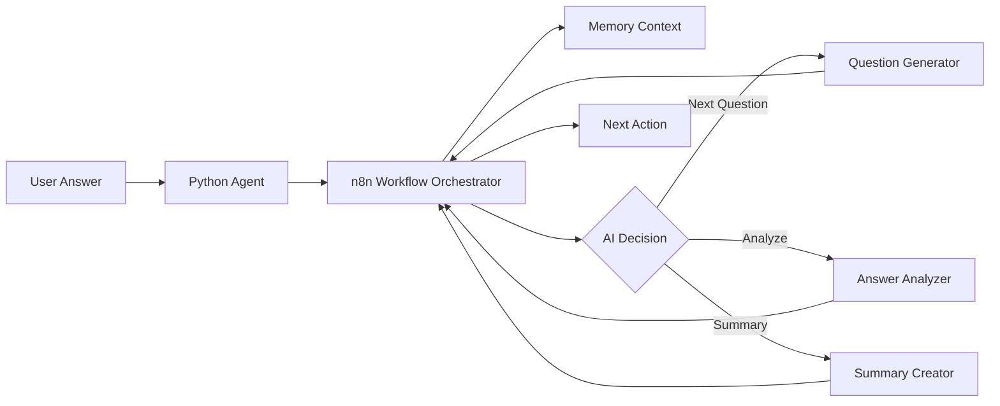

# n8n Architecture Workflows для CustDev Bot

## 🎯 Обзор архитектуры

Архитектура n8n workflows использует AI агентов для создания более гибкой и интеллектуальной системы с минимальным количеством кода.

### Основные преимущества

1. **Минимум кода** - вся логика в визуальных n8n nodes
2. **AI принимает решения** - агент сам определяет какие инструменты использовать
3. **Гибкость** - легко добавлять новые инструменты
4. **Понятный UX** - визуальное представление процессов
5. **Встроенная память** - контекст сохраняется между вызовами

## 🏗️ Компоненты системы

### 1. Python Bot Layer (минимальный)
```
src/agents/n8n/
├── ai_researcher_agent.py  # Простой прокси к n8n workflow (~130 строк)
└── ai_respondent_agent.py  # Простой прокси к n8n workflow (~130 строк)
```

Агенты только:
- Получают данные от бота
- Отправляют в n8n orchestrator
- Возвращают результат
- Обрабатывают ошибки с fallback

### 2. n8n Workflows Orchestrators
```
workflows-ai/
├── research-orchestrator.json   # n8n workflow orchestrator для исследователей
└── respondent-orchestrator.json # n8n workflow orchestrator для респондентов
```

AI агенты:
- Анализируют контекст
- Принимают решения
- Вызывают нужные инструменты
- Управляют памятью

### 3. n8n Tools (инструменты)
```
workflows-ai/tools/
├── researcher/
│   ├── field-analyzer.json         # Анализ качества ответов
│   ├── clarification-generator.json # Генерация уточнений
│   ├── brief-creator.json          # Создание брифов
│   └── database-writer.json        # Работа с БД
└── respondent/
    ├── question-generator.json     # Генерация вопросов
    ├── answer-analyzer.json        # Анализ ответов
    └── summary-creator.json        # Создание саммари
```

Каждый инструмент - отдельный workflow:
- **Field Analyzer** - проверяет полноту ответа с оценкой 1-10
- **Clarification Generator** - создает уточняющие вопросы
- **Brief Creator** - генерирует интервью-бриф в markdown
- **Database Writer** - универсальный инструмент для Supabase
- **Question Generator** - генерирует первый и последующие вопросы
- **Answer Analyzer** - анализирует глубину и эмоциональность
- **Summary Creator** - создает итоговое резюме интервью

## 🔄 Поток данных

### Research Flow


### Respondent Flow


## 🧠 n8n Workflow Agent поведение

### Research Orchestrator

**System Prompt:**
```
Ты - интеллектуальный помощник для создания кастдев-исследований.
Анализируй сообщения и используй доступные инструменты.
```

**Логика принятия решений:**
1. Если получен ответ → анализировать качество
2. Если ответ неполный → генерировать уточнение
3. Если все данные собраны → создать бриф
4. Всегда сохранять важные данные

### Respondent Orchestrator

**System Prompt:**
```
Ты - опытный интервьюер, проводящий глубинные интервью.
Задавай открытые вопросы и развивай темы на основе ответов.
```

**Логика интервью:**
1. Начать с общего вопроса
2. Развивать темы из ответов
3. Минимум 8 вопросов
4. Завершить благодарностью

## 🔧 Установка и настройка

### 1. Импорт workflows

1. Откройте n8n
2. Импортируйте `research-orchestrator.json`
3. Импортируйте `respondent-orchestrator.json`
4. Импортируйте все файлы из папок `tools/researcher/` и `tools/respondent/`

### 2. Настройка credentials

Создайте в n8n:
- **OpenAI API** - для AI моделей
- **Supabase API** - для базы данных

### 3. Получение ID workflows

После импорта tools, запишите их ID:
1. Откройте каждый tool workflow
2. Скопируйте ID из URL или настроек
3. Эти ID нужны для настройки orchestrators

### 4. Настройка orchestrators

В orchestrator workflows:
1. Найдите Tool nodes
2. Замените `$fromAI()` на реальные ID:
   ```
   workflowId: "field_analyzer_id_here"
   ```

### 5. Активация

1. Активируйте все tool workflows
2. Активируйте orchestrator workflows
3. Скопируйте webhook URLs

## 🔑 Конфигурация бота

### Переменные окружения
```env
# Режим работы агентов
AGENT_MODE=ai  # Активирует n8n workflow режим

# n8n webhooks
N8N_WEBHOOK_URL=https://your-n8n.com/webhook/custdev-bot
N8N_API_KEY=your_api_key_here
```

### n8n настройки
- OpenAI credentials для AI моделей
- Supabase credentials для БД
- Memory nodes для контекста

## 💡 Использование

### Python агенты

Новые AI агенты (`AIResearcherAgent`, `AIRespondentAgent`) автоматически:
- Отправляют данные в orchestrator
- Получают результаты от AI
- Обрабатывают ошибки с fallback

### Примеры запросов

```python
# Research flow
response = await agent._call_ai_orchestrator({
    "type": "evaluate_answer",
    "field": "industry",
    "answer": "IT и разработка ПО",
    "session_id": "researcher_123"
})

# Respondent flow  
response = await agent._call_ai_orchestrator({
    "type": "start_interview",
    "instruction": "Инструкция для интервью",
    "session_id": "respondent_456"
})
```

## 🛠️ Добавление новых инструментов

1. Создайте новый workflow с webhook trigger
2. Добавьте логику обработки
3. Экспортируйте в соответствующую папку `tools/`
4. Добавьте Tool node в orchestrator
5. Обновите AI prompt с описанием

## 📊 Мониторинг и отладка

- Все операции логируются в n8n executions
- AI объясняет свои решения в output
- Метрики доступны в n8n dashboard
- Ошибки обрабатываются gracefully с fallback

## 🆚 Сравнение режимов работы

| Аспект | Direct Mode | n8n Mode | n8n Workflows Mode |
|--------|------------|----------|---------|
| Код Python | 500+ строк | 300+ строк | <200 строк |
| Гибкость | Низкая | Средняя | Высокая |
| Сложность | Высокая | Средняя | Низкая |
| Скорость разработки | Медленно | Средне | Быстро |
| Требования | Python | Python + n8n | n8n + AI Agents |

## 🎓 Best Practices

### AI Prompts
- Четкие инструкции на русском языке
- Примеры использования инструментов
- Ограничения и правила поведения

### Tools Design
- Одна задача = один tool
- Понятные названия и описания
- Структурированный JSON output
- Обработка ошибок внутри tool

### Error Handling
- Fallback логика в Python агентах
- Retry механизм в n8n
- AI адаптация к ошибкам tools

## 📚 Расширенные возможности

### Кастомизация AI поведения

В orchestrator можно настроить:
- System message для изменения стиля
- Temperature для креативности (0.3-0.8)
- Max iterations для ограничения циклов
- Output format через структурированный parser

### Дополнительные tools

Можно добавить:
- Web search для поиска информации
- Calculator для вычислений
- Custom code для специфичной логики
- External API для интеграций

## 🚨 Troubleshooting

### AI не вызывает tools
- Проверьте описания tools в orchestrator
- Убедитесь что workflows активны
- Проверьте права доступа к workflows

### Ошибки timeout
- Увеличьте timeout в webhook settings (до 60s)
- Оптимизируйте tools для скорости
- Используйте параллельное выполнение

### Неправильные результаты
- Уточните AI prompt в orchestrator
- Добавьте примеры в system message
- Используйте Output Parser для структуры

## 🔄 Миграция с предыдущих версий

Если вы использовали старые workflows:
1. Экспортируйте данные из старых workflows
2. Деактивируйте старые workflows
3. Импортируйте новые AI workflows
4. Обновите `AGENT_MODE=ai` в `.env`
5. Перезапустите бота

## 🔮 Будущие возможности

- Multi-agent системы для сложных задач
- Автоматическое обучение на успешных интервью
- Интеграция с внешними AI сервисами
- Real-time адаптация к стилю респондента
- Аналитика качества интервью
- Экспорт в различные форматы (PDF, DOCX)